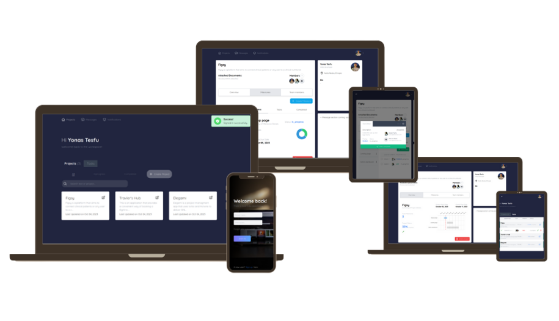

<div align="center">

  
  <br/>

</div>

# 📗 Table of Contents

- [📖 About the Project](#[project])
  - [🛠 Built With](#built-with)
    - [Tech Stack](#tech-stack)
    - [Key Features](#key-features)
  - [🚀 Live Demo](#live-demo)
- [💻 Getting Started](#getting-started)
  - [Prerequisites](#prerequisites)
  - [Setup](#setup)
  - [Available Scripts](#available-scripts)
- [👥 Authors](#author)
- [🔭 Future Features](#future-features)
- [🤝 Contributing](#contributing)
- [⭐️ Show your support](#support)
- [🙏 Acknowledgements](#acknowledgments)
- [📝 License](#license)

# 📖 Elegami <a name="about-project"></a>

- A dynamic project management solution designed to enhance collaboration and efficiency. With intuitive task management, visual project planning, and real-time updates, it empowers teams to streamline workflows and drive project success.

## 🛠 Built With <a name="built-with"></a>

### Tech Stack <a name="tech-stack"></a>

<details>
  <summary>Client</summary>
  <ul>
    <li>HTML</li>
    <li><a href="https://tailwindcss.com/">Tailwind CSS</a></li>
    <li><a href="https://stimulus.hotwired.dev/">StimulusJS</a></li>
  </ul>
</details>

<details>
  <summary>Server</summary>
  <ul>
    <li><a href="https://rubyonrails.org/">Ruby on Rails</a></li>
    <li><a href="https://hotwired.dev/">Hotwire</a></li>
  </ul>
</details>

<details>
<summary>Database</summary>
  <ul>
    <li><a href="https://www.postgresql.org/">PostgreSQL</a></li>
  </ul>
</details>

### Key Features v1.1 <a name="key-features"></a>

- `Seamless Collaboration`: provides a collaborative workspace where your team members can work together effortlessly, share files, and communicate in real-time.
- `Real-Time Updates`: Receive instant notifications and updates, informing you about project developments and changes.
- `Visual Project Planning`: Visualize your project's progress with interactive Gantt charts and timelines. Gain insights into project timelines, dependencies, and milestones.

## 🚀 Live Demo <a name="live-demo"></a>

- You can find the live version [here](https://elegami.onrender.com/)

<p align="right">(<a href="#readme-top">back to top</a>)</p>

## 💻 Getting Started <a name="getting-started"></a>

### Prerequisites

- <a href="https://www.ruby-lang.org/en/news/2022/11/24/ruby-3-1-3-released/">Ruby</a>
- <a href="https://rubyonrails.org/">Ruby on Rails</a>
- <a href="https://www.postgresql.org/">PostgreSQL</a>
- any code editor

### Setup

To setup the project follow the steps:

1.  Clone this project using Git Bash:

    ```
    git clone https://github.com/yonas44/Elegami.git
    ```

2.  Inside the project directory, install the project's dependencies

    ```
    bundle install
    ```

3.  Create the app's database

    ```
    rails db:create
    ```

4.  Setup the app's database
    ```
    rails db:setup
    ```

### Available Scripts

In the project directory, you can run:

- ```
  rails server
  ```

  Runs the app local server

- ```
  bundle exec rspec
  ```
  Launches the test runner.

## 👥 Author <a name="authors"></a>

👤 **Yonas Tesfu**

- GitHub: [@yonas44](https://github.com/yonas44)
- LinkedIn: [Yonas Tesfu](https://linkedin.com/in/yonas-tesfu)

<p align="right">(<a href="#readme-top">back to top</a>)</p>

## 🔭 Future Features <a name="future-features"></a>

- `Add Integration Capabilities`: Seamlessly integrate with popular project management tools and software to enhance your workflow.

## 🤝 Contributing <a name="contributing"></a>

Contributions, issues, and feature requests are welcome!

Feel free to check the [issues page](../../issues/).

## ⭐️ Show your support <a name="support"></a>

If you like this project give it a star!

## 📝 License <a name="license"></a>

This project is [MIT](./MIT.md) licensed.
